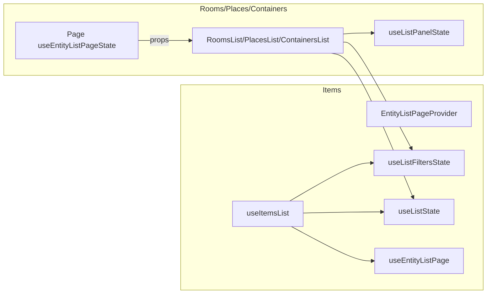
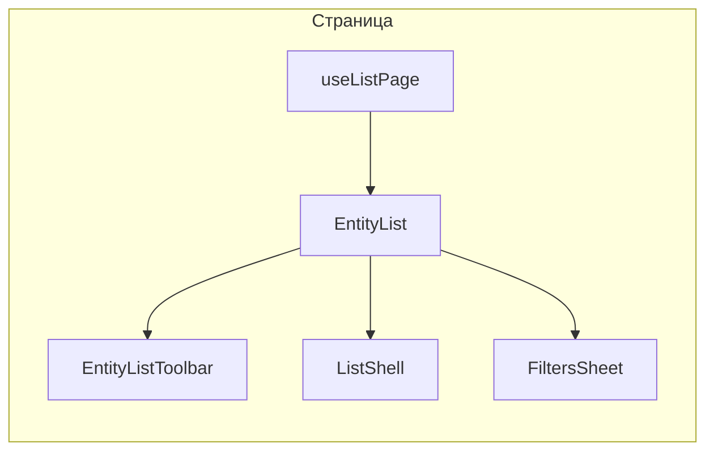

# Рефакторинг хуков и логики списков

## 1. Цель

Упростить и унифицировать логику страниц списков (items, rooms, places, containers): один хук, один компонент списка, один компонент строки, одна панель фильтров и единая система конфигов. Убрать контекст и дублирующие хуки.

**Требование по запросам и рендеру:** не должно быть лишних запросов к API. То, что не выводится на экран, не должно рендериться и запрашиваться без сильной необходимости. То есть: запросы только под видимый контент и конфиг (filterConfig, columnsConfig); не монтировать и не подгружать данные для скрытых блоков (например опции фильтров — только для полей из filterConfig и при необходимости, панель фильтров может подгружать опции при открытии); список данных — один запрос с учётом фильтров и пагинации, без дублирующих или опережающих запросов для неотображаемого.

---

## 2. Текущая архитектура

- **Items:** состояние в контексте (`EntityListPageProvider`), `useItemsList` опирается на `useEntityListPage()`, плюс `useListState`, `useListFiltersState`.
- **Rooms/Places/Containers:** состояние в странице через `useEntityListPageState()`, пропсами в тулбар и список; внутри списка снова вызываются `useListState`, `useListFiltersState`, `useListPanelState` — дублирование и лишний слой.

**Проблемы:** два подхода к состоянию (контекст vs пропсы); `useListPanelState` только пробрасывает filtersOpen; неиспользуемые части в `useListState`; лишние пропсы у RoomsList/PlacesList/ContainersList; четыре отдельные панели фильтров и четыре типа строк.




---

## 3. Целевая архитектура

**Принцип:** один хук = вся страница. Search, sort, фильтры, isFiltersOpen, loading, data, конфиги и handlers возвращаются из хука. Нет контекста, нет отдельных useListState / useListFilters / useListPanelState.




### 3.1 Файлы и роли


| Где          | Файл / компонент                                                                                                                                                                          | Назначение                                                                                                                                                                                                                                                                                                                                                     |
| ------------ | ----------------------------------------------------------------------------------------------------------------------------------------------------------------------------------------- | -------------------------------------------------------------------------------------------------------------------------------------------------------------------------------------------------------------------------------------------------------------------------------------------------------------------------------------------------------------- |
| Хук страницы | `lib/app/hooks/use-list-page.ts`                                                                                                                                                          | Универсальный хук; конфиг задаёт тип сущности (items/rooms/places/containers), конфиги подтягиваются из `lib/entities/…/list-config.ts`. Возвращает data, state, handlers и конфиги. Внутри — логика request-key и debounce.                                                                                                                                   |
| Контексты    | остаются: `current-page-context.tsx`, `quick-move-context.tsx`. **Удалить:** `entity-list-page-context.tsx`.                                                                              | —                                                                                                                                                                                                                                                                                                                                                              |
| UI списка    | в `components/lists/`: `entity-list-toolbar.tsx`, `list-filters-sheet.tsx`, `list-shell.tsx`, `list-error-card.tsx`, `list-empty-state.tsx`, `list-pagination.tsx`, `list-search-bar.tsx` | Только для списков; EntityList их использует. Префикс list- для оболочки и состояний. Не объединять в entity-list-ui.tsx.                                                                                                                                                                                                                                      |
| Список       | `components/lists/entity-list.tsx`                                                                                                                                                        | Принимает данные и конфиги от страницы. Внутри рендерит **EntityListToolbar** (lists), затем **ListShell** (lists/list-shell) — при loading EntityListSkeleton, иначе **ListFiltersSheet** (lists) с EntityFiltersPanel, Table + EntityRow. ListShell использует ListErrorCard, ListEmptyState из lists. Пагинация для items — ListPagination (lists) снаружи. |
| Строки       | `components/lists/entity-row.tsx`                                                                                                                                                         | Один компонент: тип сущности (item                                                                                                                                                                                                                                                                                                                             |
| Фильтры      | Один `EntityFiltersPanel`                                                                                                                                                                 | По filterConfig; четыре отдельные панели заменяются одной + конфигами по сущности.                                                                                                                                                                                                                                                                             |
| Страницы     | `app/(app)/items/page.tsx`, `rooms/page.tsx`, `places/page.tsx`, `containers/page.tsx`                                                                                                    | useListPage(config) + **EntityList** (внутри него тулбар, список, фильтры); для items — ListPagination и диалог добавления. Страница не рендерит EntityListToolbar отдельно.                                                                                                                                                                                   |


### 3.2 Конфиги списка (единая модель)

Все конфиги задаются в файле по сущности `lib/entities/<entity>/list-config.ts` (items, rooms, places, containers). useListPage принимает тип сущности или путь к конфигу и подтягивает оттуда filterConfig, columnsConfig, actionsConfig, moveFormConfig. Один набор на сущность.

**filterConfig** — поля панели фильтров:

- Массив описаний: `showDeleted`, `yesNoAll`, `locationType`, `room`, `entityType` (place/container) и т.д.
- Хранение: `lib/entities/…/list-config.ts`.
- Использование: EntityFiltersPanel рендерит виджеты по конфигу. Типы ItemsFilters, RoomsFilters и т.д. остаются для API и initialFilters.

**columnsConfig** — отображаемые колонки таблицы:

- Массив: `{ key, label, width?, hideOnMobile? }[]`.
- Хранение: `lib/entities/…/list-config.ts`.
- Использование: EntityList/EntityRow рендерят ячейки по columnsConfig; заголовки можно строить из columnsConfig (тогда tableHeader не передаётся, а EntityList строит его сам).

**actionsConfig** — доступные действия в строке:

- Список: edit, move, printLabel, duplicate, delete; опционально showRestoreWhenDeleted. Для move — есть ли слот (форма) или только колбэк.
- Хранение: `lib/entities/…/list-config.ts`.
- Использование: useListPage (или страница сущности) отдаёт колбэки только для включённых действий; **EntityActions** (в списке — в EntityRow, на странице сущности — в шапке или тулбаре) рендерит только указанные кнопки и слот moveAction по actionsConfig. Компонент действий относится к entities и используется и в списках, и на страницах самой сущности (например item/[id], room/[id]).

**moveFormConfig** — параметры формы перемещения (есть у items, places, containers; у rooms формы перемещения нет):

- Поля: enabled, destinationTypes (room | place | container), плейсхолдеры и т.п. Для rooms — enabled: false или отсутствие конфига.
- Хранение: `lib/entities/…/list-config.ts`.
- Использование: useListPage строит moveAction (форма перемещения) по moveFormConfig для сущности; EntityRow получает слот moveAction только если move в actionsConfig и moveFormConfig.enabled.

**Итог:** добавление поля, действия или параметра перемещения = правка конфига без изменения компонентов.

### 3.3 Скелетоны загрузки

**Принцип:** набор и вид скелетона зависят от контента; скелетон живёт рядом с этим контентом, чтобы при смене вёрстки не править отдельный далёкий файл.

**Где рисуются:**

- Скелетон **таблицы списка** — внутри `EntityList` или в компоненте рядом с ним (`components/lists/entity-list-skeleton.tsx`). Рендерится при `isLoading`. Структура выводится из **columnsConfig**; скелетон таблицы собирается из **entity-row-skeleton.tsx** — компонента одной строки-скелетона по columnsConfig (число ячеек, ширины, hideOnMobile). EntityListSkeleton рендерит заголовок по columnsConfig и N строк через EntityRowSkeleton, так что при изменении колонок правки в одном месте (columnsConfig и row-skeleton).
- Опционально: EntityList может принимать проп **skeleton** (ReactNode) или **renderSkeleton**, если странице нужен свой вариант; по умолчанию — EntityListSkeleton, который использует EntityRowSkeleton.

**Итог:** скелетон списка — entity-list-skeleton.tsx (таблица: заголовок + строки) и **entity-row-skeleton.tsx** (одна строка по columnsConfig) в той же папке `components/lists/`. Не выносить в общий list-skeleton с ручными rows/columns. Детали страницы (например пагинация) при необходимости могут иметь свой маленький скелетон рядом с собой на странице.

---

## 4. Что удалить

**Хуки и контекст:**  
`entity-list-page-context.tsx`, `use-entity-list-page.ts`, `use-list-panel-state.ts`, `use-list-filters.ts`, `use-list-state.ts`, `use-items-list.tsx`, `use-request-key.ts`, `use-debounced-search.ts` (логика переносится в use-list-page.ts).

**Компоненты списков и строк:**  
`rooms-list.tsx`, `places-list.tsx`, `containers-list.tsx` → один `entity-list.tsx`.  
`item-row.tsx` заменить использованием EntityRow; отдельные room-row, place-row, container-row не создавать — один `entity-row.tsx`.

**Панели фильтров:**  
`items-filters-form.tsx`, `rooms-filters-panel.tsx`, `places-filters-panel.tsx`, `containers-filters-panel.tsx` → один EntityFiltersPanel + конфиги.

**Действия:**  
`components/common/list-actions.tsx` → перенести в `lib/entities/components/entity-actions.tsx`; переименовать в EntityActions. Используется в списках (EntityRow) и на страницах сущности (item/[id], room/[id] и т.д.); рендер по actionsConfig.

**Тесты:**  
use-list-panel-state, use-list-state, use-list-filters, use-request-key, use-debounced-search (при инлайне). Новые тесты на useListPage не добавлять.

**Перенести из common в lists** (только для списков; см. п.4.1): error-card → list-error-card, empty-state → list-empty-state; entity-list-toolbar, list-pagination, list-skeleton, search-bar → list-search-bar. Создавать list-shell, list-filters-sheet сразу в lists.

---

### 4.1 Распределение по папкам и префиксы (только для списков → components/lists/)

Компоненты, используемые **только в контексте списков**, переносятся в `components/lists/` и при необходимости получают единый префикс, чтобы не размазывать логику списка по common.

**Перенести из components/common/ в components/lists/:**


| Было (common)                 | Станет (lists)            | Примечание                                                                                                       |
| ----------------------------- | ------------------------- | ---------------------------------------------------------------------------------------------------------------- |
| `error-card.tsx`              | `list-error-card.tsx`     | Сейчас только в списках. Экспорт: ListErrorCard (рекомендуется для консистентности префикса).                    |
| `empty-state.tsx`             | `list-empty-state.tsx`    | Только в списках. Экспорт: ListEmptyState (рекомендуется для консистентности префикса).                          |
| `list-shell.tsx` (создать)    | `list-shell.tsx`          | Уже с префиксом; создаётся в lists. Оболочка: error → ListErrorCard, loading → children, empty → ListEmptyState. |
| `filters-sheet.tsx` (создать) | `list-filters-sheet.tsx`  | Создаётся в lists; префикс list- для единообразия.                                                               |
| `entity-list-toolbar.tsx`     | `entity-list-toolbar.tsx` | Только страницы списков; перенос в lists (префикс entity-list- уже есть).                                        |
| `list-pagination.tsx`         | `list-pagination.tsx`     | Только items page (список); перенос в lists.                                                                     |
| `list-skeleton.tsx`           | `list-skeleton.tsx`       | Только в списках (grid-вариант); перенос в lists. После рефакторинга таблица использует entity-list-skeleton.    |
| `search-bar.tsx`              | `list-search-bar.tsx`     | Сейчас используется только в entity-list-toolbar → перенос в lists.                                              |


**Остаются в components/common/** (используются вне списков):  
`error-message.tsx`, `form-footer.tsx`, `image-upload.tsx`, `logo.tsx`, `native-app-marker.tsx`, `page-header.tsx`, `qr-scanner.tsx`, `search-form.tsx`. При реализации проверить использование `search-form.tsx`; если только в контексте списков — перенести в lists.

**Уже по плану:**  
`list-actions.tsx` → `lib/entities/components/entity-actions.tsx` (действия сущности в списках и на странице сущности).

**Итог:** В `components/lists/` живут entity-list, entity-row, entity-list-skeleton, entity-row-skeleton, list-shell, list-filters-sheet, list-error-card, list-empty-state, entity-list-toolbar, list-pagination, list-skeleton, list-search-bar. Общий префикс для «оболочки» списка: **list-** (list-shell, list-filters-sheet, list-error-card, list-empty-state); для тулбара и таблицы — **entity-list-** / **entity-row-** уже заданы.

---

## 5. Этапы реализации

**Этап 1 — Хук и UI-оболочки**

- Создать `lib/entities/items/list-config.ts`, `lib/entities/rooms/list-config.ts`, `lib/entities/places/list-config.ts`, `lib/entities/containers/list-config.ts`: в каждом — filterConfig, columnsConfig, actionsConfig, moveFormConfig для данной сущности.
- Создать `lib/app/hooks/use-list-page.ts`: универсальный хук; конфиг задаёт тип списка (items / rooms / places / containers) и подтягивает конфиги из соответствующего list-config.ts. Возвращает data, state, конфиги, handlers. Внутри — state (search, sort, filters, isFiltersOpen, add dialog для items), загрузка; инлайнить логику useRequestKey и useDebouncedSearch. Типы (EntityListState, конфиг) в начале файла. Редирект по auth не добавлять.
- Удалить: entity-list-page-context, use-items-list, use-entity-list-page, use-list-state, use-list-filters, use-list-panel-state, use-request-key, use-debounced-search.
- Тулбар, list-shell, list-filters-sheet создаются в **components/lists/** (см. этап 2–3); тулбар без контекста.

**Этап 2 — EntityList, EntityRow, фильтры**

- Создать в `components/lists/`: `list-shell.tsx` (оболочка: error → ListErrorCard, loading → children, empty → ListEmptyState), `list-filters-sheet.tsx` (Sheet + заголовок, счётчик фильтров), `list-error-card.tsx` и `list-empty-state.tsx` (перенести из common, экспорт ListErrorCard / ListEmptyState). ListShell импортирует их из той же папки lists. Остальные переносы из common (entity-list-toolbar, list-pagination, list-search-bar, list-skeleton) — в этапе 3.
- Создать `entity-row-skeleton.tsx`: скелетон одной строки таблицы по columnsConfig (ячейки, ширины, hideOnMobile). Используется внутри EntityListSkeleton.
- Создать `entity-list-skeleton.tsx`: скелетон таблицы — заголовок по columnsConfig + N строк через EntityRowSkeleton.
- Создать `entity-list.tsx`: принимает от страницы data, конфиги и state (в т.ч. searchQuery, sort, resultsCount, resultsLabel, isFiltersOpen, setIsFiltersOpen — для тулбара). Внутри рендерит **EntityListToolbar**, затем при loading — EntityListSkeleton; иначе **ListShell**, Table + EntityRow, **ListFiltersSheet** с EntityFiltersPanel. Пагинация для items снаружи.
- Перенести `components/common/list-actions.tsx` в `lib/entities/components/entity-actions.tsx`; переименовать компонент в EntityActions (actionsConfig + колбэки; использование в списках и на страницах сущности). Обновить импорты.
- Создать `entity-row.tsx`: тип сущности, data, actions, columnsConfig, moveAction (слот); внутри — EntityActions. Один экспорт, рендер по типу и конфигам.
- Создать EntityFiltersPanel: filterConfig, filters, onFiltersChange; по конфигу — виджеты (YesNoAllFilter, LocationTypeSelect, RoomsSelect и т.д.). Конфиги — из lib/entities/…/list-config.ts. Запросы опций для фильтров (списки комнат, типов и т.д.) — только для полей из filterConfig и при необходимости (например ленивая подгрузка при открытии панели), без лишних API-вызовов.
- Перевести страницы items, rooms, places, containers на useListPage + EntityList (тулбар внутри EntityList); для items — ListPagination и диалог добавления. Удалить rooms-list, places-list, containers-list и четыре панели фильтров; заменить использование ItemRow на EntityRow.

**Этап 3 — Зачистка**

- Удалить оставшиеся перечисленные файлы и тесты (п.4), в том числе `components/common/list-actions.tsx` после переноса в lib/entities/components/entity-actions.tsx. Перенести из common в lists (п.4.1): entity-list-toolbar, list-pagination, search-bar → list-search-bar, list-skeleton. (list-shell, list-filters-sheet, list-error-card, list-empty-state уже в lists после этапа 2.) Обновить все импорты; удалить из common перенесённые файлы.

---

## 6. Финальная структура файлов и зависимостей

### 6.1 Дерево файлов (затрагиваемые области)

После рефакторинга релевантные файлы выглядят так:

```
app/(app)/
  items/
    page.tsx          → useListPage(itemsConfig), EntityList (тулбар внутри), ListPagination, диалог добавления
  rooms/
    page.tsx          → useListPage(roomsConfig), EntityList
  places/
    page.tsx          → useListPage(placesConfig), EntityList
  containers/
    page.tsx          → useListPage(containersConfig), EntityList

lib/app/
  hooks/
    use-list-page.ts  → [новый] конфиг, data, state, конфиги (filter/columns/actions/moveForm), handlers
  contexts/
    current-page-context.tsx   (без изменений)
    quick-move-context.tsx     (без изменений)
    entity-list-page-context.tsx  УДАЛИТЬ

lib/entities/
  components/
    entity-actions.tsx         компонент действий сущности (actionsConfig + колбэки); используется в списках (EntityRow) и на страницах сущности (item/[id], room/[id] и т.д.)
  hooks/
    use-item-list-actions.ts   хуки действий списка по типу сущности (useListPage подтягивает по конфигу; без выделения одной сущности)
  items/
    list-config.ts              конфиги списка items (filterConfig, columnsConfig, actionsConfig, moveFormConfig)
  rooms/
    list-config.ts              конфиги списка rooms
  places/
    list-config.ts              конфиги списка places
  containers/
    list-config.ts              конфиги списка containers

lib/shared/
  cache/
    simple-list-cache.ts       (без изменений)

components/common/
  error-message.tsx, form-footer.tsx, image-upload.tsx, logo.tsx, native-app-marker.tsx, page-header.tsx, qr-scanner.tsx, search-form.tsx   (используются вне списков)

components/lists/
  entity-list.tsx               → EntityListToolbar, ListShell, ListFiltersSheet, EntityFiltersPanel, EntityListSkeleton, Table, EntityRow
  entity-list-toolbar.tsx       (перенесён из common; только для списков)
  entity-list-skeleton.tsx      → скелетон таблицы: заголовок по columnsConfig + N × EntityRowSkeleton
  entity-row-skeleton.tsx       → скелетон одной строки по columnsConfig
  entity-row.tsx                → EntityActions, ячейки по columnsConfig, слот moveAction
  list-shell.tsx                оболочка: error → ListErrorCard, loading → children, empty → ListEmptyState
  list-filters-sheet.tsx        Sheet + заголовок, счётчик активных фильтров, children
  list-error-card.tsx           (перенесён из common/error-card)
  list-empty-state.tsx          (перенесён из common/empty-state)
  list-pagination.tsx           (перенесён из common)
  list-search-bar.tsx           (перенесён из common; используется в entity-list-toolbar)
  list-skeleton.tsx             опционально для grid-варианта (таблица — entity-list-skeleton)

components/filters/
  entity-filters-panel.tsx      → EntityFiltersShell, виджеты по filterConfig (YesNoAllFilter, LocationTypeSelect, …)
  entity-filters-shell.tsx      (без изменений)
  yes-no-all-filter.tsx
  show-deleted-checkbox.tsx
  … (виджеты без изменений)
```

**Удалённые файлы:**  
`lib/app/contexts/entity-list-page-context.tsx`  
`lib/app/hooks/use-entity-list-page.ts`, `use-list-panel-state.ts`, `use-list-filters.ts`, `use-list-state.ts`, `use-items-list.tsx`, `use-request-key.ts`, `use-debounced-search.ts`  
`components/lists/rooms-list.tsx`, `places-list.tsx`, `containers-list.tsx`, `item-row.tsx`  
`components/filters/items-filters-form.tsx`, `rooms-filters-panel.tsx`, `places-filters-panel.tsx`, `containers-filters-panel.tsx`  
`components/common/list-actions.tsx` (перенесён в `lib/entities/components/entity-actions.tsx`)  
Перенесены из common в lists (п.4.1): `error-card.tsx` → `list-error-card.tsx`, `empty-state.tsx` → `list-empty-state.tsx`, `entity-list-toolbar.tsx`, `list-pagination.tsx`, `list-skeleton.tsx`, `search-bar.tsx` → `list-search-bar.tsx`. Создаются в lists: `list-shell.tsx`, `list-filters-sheet.tsx`.

### 6.2 Зависимости (кто от кого зависит)

```
Страница (items/rooms/places/containers)
  ├── useListPage(config)        ← lib/app/hooks/use-list-page
  │     └── колбэки действий строки ← из конфига / хука сущности (lib/entities/hooks/ по типу сущности)
  │     └── simple-list-cache (при необходимости)
  ├── EntityList                ← components/lists/entity-list
  │     ├── EntityListToolbar   ← components/lists/entity-list-toolbar
  │     │     └── ListSearchBar ← components/lists/list-search-bar
  │     ├── ListShell           ← components/lists/list-shell
  │     │     ├── ListErrorCard ← components/lists/list-error-card
  │     │     ├── ListEmptyState← components/lists/list-empty-state
  │     │     └── (children: таблица или скелетон)
  │     ├── ListFiltersSheet    ← components/lists/list-filters-sheet
  │     │     └── EntityFiltersPanel  ← components/filters/entity-filters-panel
  │     │           └── EntityFiltersShell + виджеты по filterConfig
  │     ├── EntityListSkeleton   ← components/lists/entity-list-skeleton (заголовок + EntityRowSkeleton × N)
  │     │     └── EntityRowSkeleton ← components/lists/entity-row-skeleton (по columnsConfig)
  │     └── Table + EntityRow    ← components/lists/entity-row
  │           └── EntityActions  ← lib/entities/components/entity-actions
  └── (items) ListPagination    ← components/lists/list-pagination
```

**Поток данных:**  
Конфиг задаётся в list-config по сущности → useListPage возвращает его вместе с data и state → страница передаёт всё в EntityList → EntityList внутри рендерит EntityListToolbar, затем передаёт данные в EntityFiltersPanel, EntityRow, EntityListSkeleton; колбэки действий — в EntityRow → EntityActions. На страницах сущности (item/[id], room/[id] и т.д.) те же actionsConfig и EntityActions используются в шапке/тулбаре.

### 6.3 Итог

- **Один вход:** страница вызывает useListPage(config) и получает всё для рендера.
- **Конфиги** живут в lib/entities/…/list-config.ts; useListPage подтягивает их по типу сущности.
- **Список:** EntityList и вся UI списка (тулбар, shell, filters-sheet, error-card, empty-state, pagination, search-bar, скелетоны) живут в **components/lists/** с префиксами list- / entity-list- / entity-row-. В common остаются только компоненты, используемые вне списков. Зависимости не замыкаются на удалённые хуки и контекст.
- **Страницы** не зависят от entity-list-page-context и не импортируют удалённые списки и панели фильтров.

---

## 7. Принятые решения

- Имя хука: **use-list-page.ts**.
- Тулбар, ListShell, ListFiltersSheet, EntityList — **отдельные файлы в components/lists/**; не объединять в entity-list-ui.tsx. **EntityListToolbar рендерится внутри EntityList**. Компоненты, используемые только для списков (error-card, empty-state, shell, filters-sheet, toolbar, pagination, search-bar, list-skeleton), переносятся в lists с префиксом list- или entity-list-.
- Строки: **один entity-row.tsx**, один универсальный компонент по типу сущности (item | room | place | container). Скелетон: **entity-list-skeleton.tsx** (таблица) и **entity-row-skeleton.tsx** (одна строка по columnsConfig); EntityListSkeleton использует EntityRowSkeleton.
- Заголовки: страница передаёт **tableHeader** (ReactNode) или **columnsConfig** — тогда EntityList строит заголовки сам; Row заголовки не рендерит.
- Редирект по auth только в layout.
- useRequestKey и useDebouncedSearch инлайнятся в useListPage; отдельные файлы удаляются.
- Один useListPage для items и для rooms/places/containers; конфиги хранятся в `lib/entities/<entity>/list-config.ts`, по одному файлу на сущность (items, rooms, places, containers).
- Диалог «добавить» на items управляется из useListPage; рендер на странице items.
- Тесты перечисленных хуков удалить; новые на useListPage не добавлять.
- Контракт: data, isLoading, error, filters, setFilters, isFiltersOpen, setIsFiltersOpen, searchQuery, filterConfig, columnsConfig, actionsConfig, moveFormConfig (где есть), колбэки; resultsLabel из конфига.
- **Действия:** компонент действий сущности живёт в `lib/entities/components/entity-actions.tsx` (EntityActions); используется в списках (EntityRow) и на страницах сущности (item/[id], room/[id] и т.д.); рендер по actionsConfig. Не в common.
- Фильтры: один EntityFiltersPanel по filterConfig; четыре панели удаляются.
- Поля, действия, перемещение: задаются в list-config.ts по сущности (columnsConfig, actionsConfig, moveFormConfig). EntityActions (lib/entities/components/entity-actions) используется и в списках (EntityRow), и на страницах сущности; рендер по actionsConfig.
- **Запросы и рендер:** без лишних запросов к API; не выводимое на экран не рендерится и не запрашивается без необходимости. Запросы — только под видимый контент и конфиг; опции для фильтров — только для полей из filterConfig и при необходимости (например при открытии панели); один запрос списка с фильтрами и пагинацией.

---

## Проверка консистентности (итог)

- **Пути:** Вся UI списка в `components/lists/` (entity-list, entity-row, entity-list-toolbar, list-shell, list-filters-sheet, list-error-card, list-empty-state, list-pagination, list-search-bar, list-skeleton, entity-list-skeleton, entity-row-skeleton). Действия сущности — `lib/entities/components/entity-actions.tsx`. Конфиги — `lib/entities/<entity>/list-config.ts`. Общего префикса list- придерживаемся для оболочки и состояний списка.
- **Этапы:** list-shell, list-filters-sheet, list-error-card, list-empty-state создаются/переносятся в этапе 2 (чтобы EntityList и ListShell могли импортировать из lists). В этапе 3 — перенос entity-list-toolbar, list-pagination, list-search-bar, list-skeleton и зачистка common.
- **Имена:** ListFiltersSheet (не FiltersSheet в коде), ListErrorCard, ListEmptyState — для консистентности с префиксом list-. EntityListToolbar рендерится внутри EntityList; страница не рендерит тулбар отдельно.
- **Нерешённые мелочи (на реализацию):** использование `search-form.tsx` — при реализации проверить; при необходимости перенести в lists. Проп `skeleton` / `renderSkeleton` у EntityList — опционально, по умолчанию EntityListSkeleton.

